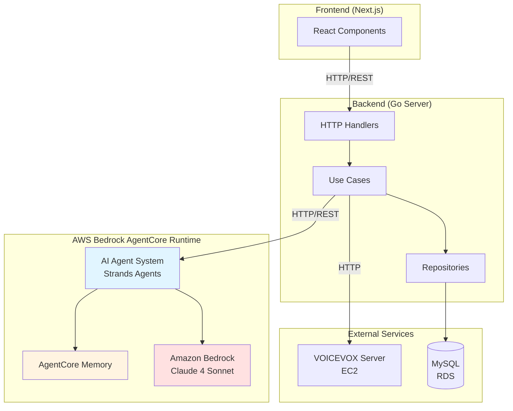
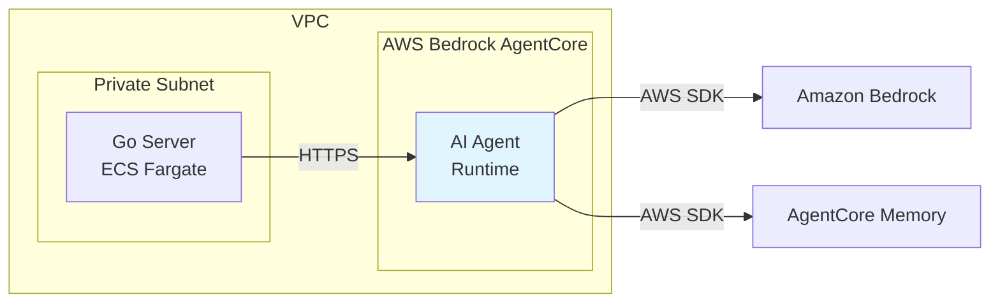

# Design Document

## Overview

本設計書は、Strands Agentsフレームワークを使用したAI Agent Systemの詳細設計を定義します。AI Agent SystemはAWS Bedrock AgentCore Runtime上にデプロイされ、ゲーム内の動的コンテンツ生成を担当します。

### システム構成図




## Architecture

### レイヤー構成

AI Agent Systemは以下のレイヤーで構成されます：

1. **API Layer**: HTTP/RESTエンドポイントを提供し、Go Serverからのリクエストを受け付ける
2. **Agent Layer**: Strands Agentsフレームワークを使用したエージェント実装
3. **Tool Layer**: エージェントが使用する各種ツール（クイズ生成、バリデーション等）
4. **Memory Layer**: AgentCore Memoryを使用した過去データの保存・検索
5. **LLM Layer**: Amazon Bedrockを通じたClaude 4 Sonnetへのアクセス

### デプロイメントアーキテクチャ



- AI Agent SystemはAWS Bedrock AgentCore Runtime上で動作
- Go ServerからはHTTPS経由でAgentCore Runtimeのエンドポイントにアクセス
- AgentはAWS SDK経由でBedrockとMemoryにアクセス


## Components and Interfaces

### 1. AI Agent System (Strands Agents)

#### 1.1 Main Agent

```python
from strands import Agent

class GameAgent(Agent):
    """
    ゲーム用AIエージェント
    クイズ生成、回答バリデーション、対話生成を担当
    """
    
    def __init__(self):
        super().__init__(
            model_provider="bedrock",
            model="us.anthropic.claude-sonnet-4-20250514-v1:0",
            region="ap-northeast-1",
            tools=[
                QuizGeneratorTool(),
                ResponseValidatorTool(),
                DialogueGeneratorTool(),
                MessageVerifierTool(),
                MemorySearchTool()
            ]
        )
```

#### 1.2 API Endpoints

AI Agent SystemはHTTP/REST APIとして以下のエンドポイントを提供：

| Endpoint | Method | Description | Request | Response |
|----------|--------|-------------|---------|----------|
| `/health` | GET | ヘルスチェック | - | `{"status": "ok", "model": "...", "memory": "ok"}` |
| `/api/v1/quiz/generate` | POST | クイズ生成 | QuizGenerationRequest | QuizGenerationResponse |
| `/api/v1/response/validate` | POST | 回答バリデーション | ResponseValidationRequest | ResponseValidationResponse |
| `/api/v1/dialogue/generate` | POST | 対話生成 | DialogueGenerationRequest | DialogueGenerationResponse |
| `/api/v1/message/verify` | POST | メッセージ検証 | MessageVerificationRequest | MessageVerificationResponse |
| `/api/v1/memory/store` | POST | 回答保存 | MemoryStoreRequest | MemoryStoreResponse |


### 2. Tools Implementation

#### 2.1 QuizGeneratorTool

```python
class QuizGeneratorTool:
    """
    S4の回答を元にS6用の4択クイズを生成
    """
    
    async def generate_quiz(
        self,
        session_id: str,
        player_answers: List[PlayerAnswer],
        place_id: str,
        memory_client: MemoryClient
    ) -> Quiz:
        """
        Args:
            session_id: セッションID
            player_answers: S4の10問の回答
            place_id: 場所ID (spiral_stairs, fireplace, etc.)
            memory_client: AgentCore Memoryクライアント
            
        Returns:
            Quiz: 生成された4択クイズ
        """
        # 1. 過去プレイヤー回答をMemoryから検索
        past_answers = await memory_client.search(
            query=f"place:{place_id}",
            limit=10
        )
        
        # 2. LLMにクイズ生成を依頼
        # 3. 4択を構成（正解、プレイヤー別回答、過去回答、汎用）
        # 4. Quizオブジェクトを返す
```

#### 2.2 ResponseValidatorTool

```python
class ResponseValidatorTool:
    """
    プレイヤー回答の有効性を検証
    """
    
    async def validate(
        self,
        question: str,
        answer: str
    ) -> ValidationResult:
        """
        Args:
            question: 質問文
            answer: プレイヤーの回答
            
        Returns:
            ValidationResult: 有効/無効、理由、フィードバック
        """
        # 無効パターン検出
        invalid_patterns = ["なし", "特にない", "わからない", "思いつかない"]
        
        # LLMで文脈的妥当性を判定
        # フィードバックメッセージを生成
```


#### 2.3 DialogueGeneratorTool

```python
class DialogueGeneratorTool:
    """
    担当者との対話テキストを動的生成
    """
    
    async def generate_dialogue(
        self,
        scene: str,
        player_context: PlayerContext
    ) -> DialogueResponse:
        """
        Args:
            scene: シーン識別子 (s1_greeting, s1_purpose, etc.)
            player_context: プレイヤー情報（来館方法、普段の活動等）
            
        Returns:
            DialogueResponse: 生成された対話テキスト
        """
        # 1942年の生命保険診査という設定を維持
        # VOICEVOX用に自然な話し言葉で生成
        # 1発話100文字以内に制御
```

#### 2.4 MessageVerifierTool

```python
class MessageVerifierTool:
    """
    S7でのメッセージ再入力を検証
    """
    
    async def verify_message(
        self,
        original: str,
        reinput: str
    ) -> VerificationResult:
        """
        Args:
            original: S4で入力された元のメッセージ
            reinput: S7で再入力されたメッセージ
            
        Returns:
            VerificationResult: 一致度スコア、一致/不一致、ヒント
        """
        # 完全一致チェック
        if original == reinput:
            return VerificationResult(score=1.0, matched=True)
        
        # LLMで意味的同等性を判定
        # 不一致の場合、どの部分が異なるかヒントを生成
```


#### 2.5 MemorySearchTool

```python
class MemorySearchTool:
    """
    AgentCore Memoryから過去プレイヤー回答を検索
    """
    
    async def search_past_answers(
        self,
        query: str,
        question_id: Optional[str] = None,
        limit: int = 10
    ) -> List[PastAnswer]:
        """
        Args:
            query: 検索クエリ（セマンティック検索）
            question_id: 質問ID（フィルタリング用）
            limit: 取得件数
            
        Returns:
            List[PastAnswer]: 過去の回答リスト
        """
        # AgentCore Memoryのセマンティック検索を使用
        # 個人情報が含まれていないことを確認
        # 匿名化された回答のみを返す
    
    async def store_answer(
        self,
        session_id: str,
        question_id: str,
        answer: str,
        metadata: dict
    ) -> bool:
        """
        Args:
            session_id: セッションID（識別子）
            question_id: 質問ID
            answer: 回答テキスト
            metadata: メタデータ（タイムスタンプ等）
            
        Returns:
            bool: 保存成功/失敗
        """
        # AgentCore Memoryに保存
        # 個人情報を除外
        # 暗号化して保存
```


### 3. Go Server Integration

Go ServerからAI Agent Systemへの統合は、新しいドメインサービスとして実装します。

#### 3.1 Domain Service

```go
// internal/domain/service/ai_agent_service.go
package service

type AIAgentService interface {
    // クイズ生成
    GenerateQuiz(ctx context.Context, req *GenerateQuizRequest) (*Quiz, error)
    
    // 回答バリデーション
    ValidateResponse(ctx context.Context, question, answer string) (*ValidationResult, error)
    
    // 対話生成
    GenerateDialogue(ctx context.Context, scene string, playerCtx *PlayerContext) (string, error)
    
    // メッセージ検証
    VerifyMessage(ctx context.Context, original, reinput string) (*VerificationResult, error)
    
    // 回答保存
    StoreAnswer(ctx context.Context, sessionID, questionID, answer string) error
}
```

#### 3.2 Infrastructure Implementation

```go
// internal/infrastructure/ai/agent_client.go
package ai

type AgentClient struct {
    baseURL    string
    httpClient *http.Client
    timeout    time.Duration
}

func NewAgentClient(baseURL string) *AgentClient {
    return &AgentClient{
        baseURL: baseURL,
        httpClient: &http.Client{
            Timeout: 15 * time.Second, // AgentCore Runtimeのオーバーヘッドを考慮
        },
    }
}

func (c *AgentClient) GenerateQuiz(ctx context.Context, req *GenerateQuizRequest) (*Quiz, error) {
    // HTTP POSTリクエストを送信
    // タイムアウト処理
    // エラーハンドリング
    // フォールバック処理
}
```


## Data Models

### Request/Response Models

#### QuizGenerationRequest

```json
{
  "session_id": "uuid-v4",
  "place_id": "spiral_stairs",
  "player_answers": [
    {
      "question_id": "q1",
      "question_text": "小学生の頃、何に夢中になってた？",
      "answer": "サッカー"
    },
    ...
  ]
}
```

#### QuizGenerationResponse

```json
{
  "quiz_id": "quiz_spiral_stairs_uuid",
  "place_id": "spiral_stairs",
  "question_text": "あなたが夢中になっていたことと、担当者が夢中になっていたことは？",
  "options": [
    {
      "index": 0,
      "text": "サッカー",
      "is_correct": true,
      "source": "player_answer"
    },
    {
      "index": 1,
      "text": "読書",
      "is_correct": false,
      "source": "player_other_answer"
    },
    {
      "index": 2,
      "text": "絵を描くこと",
      "is_correct": false,
      "source": "past_player"
    },
    {
      "index": 3,
      "text": "音楽鑑賞",
      "is_correct": false,
      "source": "system_generic"
    }
  ],
  "answer_index": 0
}
```


#### ResponseValidationRequest

```json
{
  "question": "小学生の頃、何に夢中になってた？",
  "answer": "なし"
}
```

#### ResponseValidationResponse

```json
{
  "is_valid": false,
  "reason": "無効回答パターン検出",
  "feedback": "もう少し具体的に教えてください。小学生の頃に楽しかったことや、よくやっていたことを思い出してみてください。",
  "confidence": 0.95
}
```

#### DialogueGenerationRequest

```json
{
  "scene": "s1_greeting",
  "player_context": {
    "arrival_method": "電車で来ました",
    "usual_activity": "エンジニアとして働いています",
    "first_visit": true
  }
}
```

#### DialogueGenerationResponse

```json
{
  "dialogue_text": "電車でいらっしゃったのですね。お疲れ様です。エンジニアのお仕事、大変でしょう。",
  "voice_text": "電車でいらっしゃったのですね。お疲れ様です。エンジニアのお仕事、大変でしょう。",
  "estimated_duration_ms": 4500
}
```


#### MessageVerificationRequest

```json
{
  "original": "家族と幸せに暮らすこと",
  "reinput": "家族と幸せに過ごすこと"
}
```

#### MessageVerificationResponse

```json
{
  "matched": true,
  "similarity_score": 0.92,
  "reason": "意味的に同等",
  "hint": null
}
```

#### MemoryStoreRequest

```json
{
  "session_id": "uuid-v4",
  "question_id": "q1",
  "answer": "サッカー",
  "metadata": {
    "timestamp": "2025-11-07T13:00:00+09:00",
    "scene": "s4"
  }
}
```

#### MemoryStoreResponse

```json
{
  "success": true,
  "memory_id": "mem_uuid"
}
```


### AgentCore Memory Schema

AgentCore Memoryに保存されるデータ構造：

```json
{
  "id": "mem_uuid",
  "session_id": "session_uuid",
  "question_id": "q1",
  "answer_text": "サッカー",
  "embedding": [0.123, 0.456, ...],  // セマンティック検索用
  "metadata": {
    "timestamp": "2025-11-07T13:00:00+09:00",
    "scene": "s4",
    "anonymized": true
  },
  "tags": ["sport", "childhood", "activity"]
}
```

検索時のクエリ例：

```python
# 場所に関連する過去回答を検索
results = memory_client.search(
    query="お気に入りの場所",
    filters={"scene": "s4"},
    limit=10
)

# 特定の質問に対する過去回答を検索
results = memory_client.search(
    query="夢中になっていたこと",
    filters={"question_id": "q1"},
    limit=5
)
```


## Error Handling

### エラー分類と対応

| エラー種別 | HTTP Status | 対応 |
|-----------|-------------|------|
| AgentCore Runtime接続エラー | 503 | フォールバックコンテンツ使用 |
| タイムアウト | 504 | リトライ（最大2回）→フォールバック |
| Bedrock APIエラー | 502 | エラーログ記録→フォールバック |
| Memory検索エラー | 500 | システム汎用回答のみ使用 |
| 入力バリデーションエラー | 400 | エラーメッセージ返却 |
| 認証エラー | 401 | エラーログ記録→サービス停止 |

### フォールバック戦略

```python
class FallbackStrategy:
    """
    AI Agent System障害時のフォールバック処理
    """
    
    # 固定クイズテンプレート
    FALLBACK_QUIZZES = {
        "spiral_stairs": {
            "question": "この場所で何を感じましたか？",
            "options": ["懐かしさ", "不安", "期待", "静けさ"]
        },
        ...
    }
    
    # 固定対話テンプレート
    FALLBACK_DIALOGUES = {
        "s1_greeting": "ようこそ。お待ちしておりました。",
        ...
    }
    
    def get_fallback_quiz(self, place_id: str) -> Quiz:
        """固定クイズを返す"""
        return self.FALLBACK_QUIZZES.get(place_id)
    
    def get_fallback_dialogue(self, scene: str) -> str:
        """固定対話を返す"""
        return self.FALLBACK_DIALOGUES.get(scene)
```


### Go Server側のエラーハンドリング

```go
func (s *AIAgentService) GenerateQuiz(ctx context.Context, req *GenerateQuizRequest) (*Quiz, error) {
    // タイムアウト設定
    ctx, cancel := context.WithTimeout(ctx, 15*time.Second)
    defer cancel()
    
    // AI Agent Systemへリクエスト
    quiz, err := s.agentClient.GenerateQuiz(ctx, req)
    if err != nil {
        // エラーログ記録
        s.logger.Error("AI Agent quiz generation failed", 
            "error", err,
            "session_id", req.SessionID,
            "place_id", req.PlaceID)
        
        // フォールバッククイズを返す
        return s.getFallbackQuiz(req.PlaceID), nil
    }
    
    return quiz, nil
}
```

### リトライロジック

```go
func (c *AgentClient) callWithRetry(ctx context.Context, req *http.Request) (*http.Response, error) {
    maxRetries := 2
    backoff := 1 * time.Second
    
    for i := 0; i < maxRetries; i++ {
        resp, err := c.httpClient.Do(req)
        if err == nil && resp.StatusCode < 500 {
            return resp, nil
        }
        
        if i < maxRetries-1 {
            time.Sleep(backoff)
            backoff *= 2
        }
    }
    
    return nil, errors.New("max retries exceeded")
}
```


## Testing Strategy

### テストポリシー

**重要**: このプロジェクトはPoC（Proof of Concept）のため、**テストコードの作成は不要**です。

ただし、以下の手動テストは実施します：

### 手動テスト項目

#### 1. クイズ生成テスト
- S4の10問回答後、5つの場所それぞれでクイズが生成されること
- 各クイズに4つの選択肢があること
- 正解がプレイヤー自身の回答であること
- ダミー選択肢が適切に生成されること

#### 2. 回答バリデーションテスト
- 「なし」「特にない」等の無効回答が検出されること
- 有効な回答が受け入れられること
- 適切なフィードバックメッセージが返されること

#### 3. 対話生成テスト
- プレイヤーの入力に応じた対話が生成されること
- 1942年の設定が維持されていること
- 100文字以内に収まっていること

#### 4. メッセージ検証テスト
- 完全一致が正しく判定されること
- 意味的に同等な入力が正解と判定されること
- 不一致の場合にヒントが提供されること

#### 5. Memory機能テスト
- 回答がAgentCore Memoryに保存されること
- 過去回答が検索できること
- 個人情報が含まれていないこと

#### 6. エラーハンドリングテスト
- タイムアウト時にフォールバックが動作すること
- AgentCore Runtime障害時にゲームが継続できること
- エラーログが適切に記録されること


## Deployment and Configuration

### AWS Bedrock AgentCore Runtime設定

```yaml
# agentcore-config.yaml
agent:
  name: game-ai-agent
  runtime: bedrock-agentcore
  region: ap-northeast-1
  
model:
  provider: bedrock
  model_id: us.anthropic.claude-sonnet-4-20250514-v1:0
  
memory:
  type: agentcore-memory
  embedding_model: amazon.titan-embed-text-v2:0
  
scaling:
  min_capacity: 1
  max_capacity: 5
  target_utilization: 70
  
timeout:
  default: 15s
  quiz_generation: 20s
```

### 環境変数

```bash
# AI Agent System
AWS_REGION=ap-northeast-1
AWS_ACCESS_KEY_ID=<IAM_KEY>
AWS_SECRET_ACCESS_KEY=<IAM_SECRET>
BEDROCK_MODEL_ID=us.anthropic.claude-sonnet-4-20250514-v1:0
AGENTCORE_MEMORY_ID=<MEMORY_ID>
LOG_LEVEL=INFO

# Go Server
AI_AGENT_BASE_URL=https://<agentcore-endpoint>.amazonaws.com
AI_AGENT_TIMEOUT=15s
AI_AGENT_RETRY_MAX=2
FALLBACK_MODE=enabled
```


### IAM Permissions

AI Agent Systemに必要なIAMポリシー：

```json
{
  "Version": "2012-10-17",
  "Statement": [
    {
      "Effect": "Allow",
      "Action": [
        "bedrock:InvokeModel",
        "bedrock:InvokeModelWithResponseStream"
      ],
      "Resource": "arn:aws:bedrock:ap-northeast-1::foundation-model/us.anthropic.claude-sonnet-4-*"
    },
    {
      "Effect": "Allow",
      "Action": [
        "bedrock:CreateMemory",
        "bedrock:GetMemory",
        "bedrock:UpdateMemory",
        "bedrock:DeleteMemory",
        "bedrock:SearchMemory"
      ],
      "Resource": "arn:aws:bedrock:ap-northeast-1:*:memory/*"
    },
    {
      "Effect": "Allow",
      "Action": [
        "logs:CreateLogGroup",
        "logs:CreateLogStream",
        "logs:PutLogEvents"
      ],
      "Resource": "arn:aws:logs:ap-northeast-1:*:log-group:/aws/bedrock/agentcore/*"
    }
  ]
}
```


### Terraform設定

```hcl
# infra/ai_agent.tf

# AgentCore Runtime用のIAMロール
resource "aws_iam_role" "ai_agent_role" {
  name = "game-ai-agent-role"
  
  assume_role_policy = jsonencode({
    Version = "2012-10-17"
    Statement = [{
      Action = "sts:AssumeRole"
      Effect = "Allow"
      Principal = {
        Service = "bedrock.amazonaws.com"
      }
    }]
  })
}

# Bedrockアクセスポリシー
resource "aws_iam_role_policy" "ai_agent_bedrock_policy" {
  name = "bedrock-access"
  role = aws_iam_role.ai_agent_role.id
  
  policy = jsonencode({
    Version = "2012-10-17"
    Statement = [
      {
        Effect = "Allow"
        Action = [
          "bedrock:InvokeModel",
          "bedrock:InvokeModelWithResponseStream"
        ]
        Resource = "arn:aws:bedrock:${var.aws_region}::foundation-model/us.anthropic.claude-sonnet-4-*"
      },
      {
        Effect = "Allow"
        Action = [
          "bedrock:CreateMemory",
          "bedrock:GetMemory",
          "bedrock:UpdateMemory",
          "bedrock:DeleteMemory",
          "bedrock:SearchMemory"
        ]
        Resource = "arn:aws:bedrock:${var.aws_region}:*:memory/*"
      }
    ]
  })
}

# CloudWatch Logsポリシー
resource "aws_iam_role_policy" "ai_agent_logs_policy" {
  name = "cloudwatch-logs"
  role = aws_iam_role.ai_agent_role.id
  
  policy = jsonencode({
    Version = "2012-10-17"
    Statement = [{
      Effect = "Allow"
      Action = [
        "logs:CreateLogGroup",
        "logs:CreateLogStream",
        "logs:PutLogEvents"
      ]
      Resource = "arn:aws:logs:${var.aws_region}:*:log-group:/aws/bedrock/agentcore/*"
    }]
  })
}
```


## Monitoring and Observability

### CloudWatch Metrics

監視すべきメトリクス：

| Metric | Description | Threshold |
|--------|-------------|-----------|
| `InvocationCount` | API呼び出し回数 | - |
| `InvocationLatency` | レスポンス時間 | P95 < 15s |
| `ErrorRate` | エラー率 | < 5% |
| `TokenUsage` | トークン使用量 | 監視のみ |
| `MemorySearchLatency` | Memory検索時間 | P95 < 2s |
| `FallbackRate` | フォールバック使用率 | < 10% |

### CloudWatch Logs

ログ出力形式：

```json
{
  "timestamp": "2025-11-07T13:00:00.000Z",
  "level": "INFO",
  "service": "ai-agent",
  "session_id": "uuid-v4",
  "operation": "generate_quiz",
  "duration_ms": 8500,
  "token_usage": {
    "input": 1200,
    "output": 450
  },
  "status": "success"
}
```

エラーログ形式：

```json
{
  "timestamp": "2025-11-07T13:00:00.000Z",
  "level": "ERROR",
  "service": "ai-agent",
  "session_id": "uuid-v4",
  "operation": "generate_quiz",
  "error": "Bedrock API timeout",
  "stack_trace": "...",
  "fallback_used": true
}
```


### Strands Agents Tracing

Strands Agentsの組み込みトレーシング機能を有効化：

```python
from strands import Agent
from strands.tracing import CloudWatchTracer

agent = Agent(
    model_provider="bedrock",
    model="us.anthropic.claude-sonnet-4-20250514-v1:0",
    tracer=CloudWatchTracer(
        log_group="/aws/bedrock/agentcore/game-ai-agent",
        region="ap-northeast-1"
    )
)
```

トレース情報には以下が含まれます：
- LLM呼び出しの詳細（プロンプト、レスポンス、トークン数）
- ツール実行の詳細（入力、出力、実行時間）
- エラー情報（スタックトレース、コンテキスト）
- パフォーマンスメトリクス（レイテンシ、スループット）

### アラート設定

CloudWatch Alarmsで以下のアラートを設定：

```hcl
# エラー率アラート
resource "aws_cloudwatch_metric_alarm" "ai_agent_error_rate" {
  alarm_name          = "ai-agent-high-error-rate"
  comparison_operator = "GreaterThanThreshold"
  evaluation_periods  = 2
  metric_name         = "ErrorRate"
  namespace           = "AWS/Bedrock/AgentCore"
  period              = 300
  statistic           = "Average"
  threshold           = 5.0
  alarm_description   = "AI Agent error rate exceeds 5%"
  alarm_actions       = [aws_sns_topic.alerts.arn]
}

# レイテンシアラート
resource "aws_cloudwatch_metric_alarm" "ai_agent_latency" {
  alarm_name          = "ai-agent-high-latency"
  comparison_operator = "GreaterThanThreshold"
  evaluation_periods  = 2
  metric_name         = "InvocationLatency"
  namespace           = "AWS/Bedrock/AgentCore"
  period              = 300
  statistic           = "p95"
  threshold           = 15000
  alarm_description   = "AI Agent P95 latency exceeds 15s"
  alarm_actions       = [aws_sns_topic.alerts.arn]
}
```


## Security Considerations

### データ保護

1. **個人情報の除外**
   - セッションIDのみを識別子として使用
   - IP、端末ID、位置情報等は送信しない
   - AgentCore Memoryに保存する際も個人情報を除外

2. **暗号化**
   - AgentCore Memory内のデータは自動的に暗号化される
   - 通信はHTTPS/TLS 1.3を使用
   - 環境変数の機密情報はAWS Secrets Managerで管理

3. **アクセス制御**
   - IAMロールベースの認証
   - 最小権限の原則に従ったポリシー設定
   - Go ServerからAI Agent Systemへのリクエストに認証トークンを含める

### 入力検証

```python
class InputValidator:
    """
    入力データの検証とサニタイゼーション
    """
    
    MAX_TEXT_LENGTH = 2000
    ALLOWED_CHARACTERS = r'^[\u3000-\u303f\u3040-\u309f\u30a0-\u30ff\uff00-\uffef\u4e00-\u9faf\u3400-\u4dbfa-zA-Z0-9\s.,!?、。！？]+$'
    
    def validate_answer(self, text: str) -> bool:
        """回答テキストの検証"""
        if not text or len(text) > self.MAX_TEXT_LENGTH:
            return False
        
        # 日本語、英数字、基本的な記号のみ許可
        if not re.match(self.ALLOWED_CHARACTERS, text):
            return False
        
        return True
    
    def sanitize(self, text: str) -> str:
        """テキストのサニタイゼーション"""
        # HTMLタグの除去
        text = re.sub(r'<[^>]+>', '', text)
        
        # 制御文字の除去
        text = ''.join(char for char in text if ord(char) >= 32 or char in '\n\r\t')
        
        return text.strip()
```


### コンテンツフィルタリング

```python
class ContentFilter:
    """
    生成されたコンテンツの不適切性チェック
    """
    
    INAPPROPRIATE_PATTERNS = [
        r'暴力的',
        r'差別的',
        r'性的',
        # その他の不適切なパターン
    ]
    
    def is_appropriate(self, text: str) -> bool:
        """コンテンツの適切性チェック"""
        text_lower = text.lower()
        
        for pattern in self.INAPPROPRIATE_PATTERNS:
            if re.search(pattern, text_lower):
                return False
        
        return True
    
    def filter_response(self, response: str) -> str:
        """不適切なコンテンツをフィルタリング"""
        if not self.is_appropriate(response):
            # フォールバックコンテンツを返す
            return self.get_safe_fallback()
        
        return response
```

### レート制限

```python
from strands.middleware import RateLimiter

# セッションごとのレート制限
rate_limiter = RateLimiter(
    max_requests=100,  # 1セッションあたり最大100リクエスト
    window_seconds=3600  # 1時間
)

agent = Agent(
    model_provider="bedrock",
    model="us.anthropic.claude-sonnet-4-20250514-v1:0",
    middleware=[rate_limiter]
)
```


## Performance Optimization

### キャッシング戦略

```python
from functools import lru_cache
import hashlib

class ResponseCache:
    """
    LLMレスポンスのキャッシング
    """
    
    def __init__(self, ttl_seconds=3600):
        self.cache = {}
        self.ttl = ttl_seconds
    
    def get_cache_key(self, prompt: str, params: dict) -> str:
        """キャッシュキーの生成"""
        content = f"{prompt}:{json.dumps(params, sort_keys=True)}"
        return hashlib.sha256(content.encode()).hexdigest()
    
    def get(self, key: str) -> Optional[str]:
        """キャッシュから取得"""
        if key in self.cache:
            value, timestamp = self.cache[key]
            if time.time() - timestamp < self.ttl:
                return value
            else:
                del self.cache[key]
        return None
    
    def set(self, key: str, value: str):
        """キャッシュに保存"""
        self.cache[key] = (value, time.time())
```

### バッチ処理

S6のクイズ生成は5問すべてを一度に生成：

```python
async def generate_all_quizzes(
    self,
    session_id: str,
    player_answers: List[PlayerAnswer]
) -> List[Quiz]:
    """
    5つの場所すべてのクイズを一度に生成
    """
    places = ["spiral_stairs", "fireplace", "hinge", "entrance", "piano"]
    
    # 並列実行
    tasks = [
        self.generate_quiz(session_id, player_answers, place_id)
        for place_id in places
    ]
    
    quizzes = await asyncio.gather(*tasks)
    return quizzes
```


### プロンプト最適化

効率的なプロンプト設計：

```python
QUIZ_GENERATION_PROMPT = """
あなたは1942年の生命保険会社の担当者です。
プレイヤーの回答を元に、記憶のシンクロを確認するクイズを1問生成してください。

プレイヤーの回答:
{player_answers}

場所: {place_name}

以下の形式でクイズを生成してください:
- 質問文: 担当者との記憶のシンクロを確認する質問
- 正解: プレイヤーの回答から1つ選択
- ダミー1: プレイヤーの別の回答
- ダミー2: 過去プレイヤーの回答（提供された場合）
- ダミー3: システム汎用回答

JSON形式で出力してください。
"""

# トークン数を削減するため、必要最小限の情報のみを含める
```

### AgentCore Memory最適化

```python
# セマンティック検索の最適化
async def search_relevant_answers(
    self,
    query: str,
    limit: int = 5
) -> List[PastAnswer]:
    """
    関連する過去回答を効率的に検索
    """
    # エンベディングキャッシュを使用
    query_embedding = await self.get_cached_embedding(query)
    
    # フィルタを使用して検索範囲を絞る
    results = await self.memory_client.search(
        embedding=query_embedding,
        filters={
            "scene": "s4",
            "anonymized": True
        },
        limit=limit
    )
    
    return results
```


## Implementation Phases

実装は以下の段階で進めます：

### Phase 1: 基盤構築
- Strands Agentsプロジェクトのセットアップ
- AWS Bedrock AgentCore Runtimeへのデプロイ設定
- 基本的なHTTP APIエンドポイントの実装
- ヘルスチェック機能の実装

### Phase 2: コア機能実装
- QuizGeneratorToolの実装
- ResponseValidatorToolの実装
- AgentCore Memory統合
- Go Server側のAIAgentServiceインターフェース実装

### Phase 3: 追加機能実装
- DialogueGeneratorToolの実装
- MessageVerifierToolの実装
- フォールバック機能の実装
- エラーハンドリングの強化

### Phase 4: 最適化と監視
- キャッシング機能の実装
- パフォーマンス最適化
- CloudWatch監視の設定
- アラート設定

### Phase 5: 統合テスト
- エンドツーエンドの動作確認
- フォールバック動作の確認
- パフォーマンステスト
- セキュリティチェック


## Project Structure

AI Agent Systemのディレクトリ構造：

```
agent/
├── README.md
├── requirements.txt
├── pyproject.toml
├── .env.example
├── main.py                    # エントリーポイント
├── config/
│   ├── __init__.py
│   ├── settings.py           # 設定管理
│   └── prompts.py            # プロンプトテンプレート
├── app/
│   ├── __init__.py
│   ├── agent.py              # メインエージェント
│   ├── api.py                # HTTP APIエンドポイント
│   └── middleware.py         # ミドルウェア
├── tools/
│   ├── __init__.py
│   ├── quiz_generator.py     # クイズ生成ツール
│   ├── response_validator.py # 回答バリデーションツール
│   ├── dialogue_generator.py # 対話生成ツール
│   ├── message_verifier.py   # メッセージ検証ツール
│   └── memory_search.py      # Memory検索ツール
├── models/
│   ├── __init__.py
│   ├── requests.py           # リクエストモデル
│   ├── responses.py          # レスポンスモデル
│   └── domain.py             # ドメインモデル
├── services/
│   ├── __init__.py
│   ├── memory_service.py     # AgentCore Memory操作
│   ├── cache_service.py      # キャッシング
│   └── fallback_service.py   # フォールバック処理
├── utils/
│   ├── __init__.py
│   ├── logger.py             # ロギング
│   ├── validator.py          # 入力検証
│   └── filter.py             # コンテンツフィルタリング
└── tests/                     # テストは不要（PoCのため）
```


## Dependencies

### Python Dependencies

```toml
# pyproject.toml
[project]
name = "game-ai-agent"
version = "0.1.0"
requires-python = ">=3.11"

dependencies = [
    "strands-agents>=0.1.0",
    "boto3>=1.34.0",
    "fastapi>=0.109.0",
    "uvicorn>=0.27.0",
    "pydantic>=2.5.0",
    "python-dotenv>=1.0.0",
    "httpx>=0.26.0",
    "redis>=5.0.0",  # キャッシング用
]

[project.optional-dependencies]
dev = [
    "black>=24.0.0",
    "ruff>=0.1.0",
    "mypy>=1.8.0",
]
```

### Go Dependencies

```go
// server/go.mod に追加
require (
    github.com/aws/aws-sdk-go-v2 v1.24.0
    github.com/aws/aws-sdk-go-v2/config v1.26.0
    github.com/aws/aws-sdk-go-v2/service/bedrockagent v1.5.0
)
```


## Cost Estimation

### AWS Bedrock Costs

Claude 4 Sonnet料金（2025年11月時点の想定）:
- Input: $3.00 per 1M tokens
- Output: $15.00 per 1M tokens

1プレイヤーあたりの推定トークン使用量:
- クイズ生成（5問）: 入力 6,000 tokens、出力 2,000 tokens
- 回答バリデーション（10問）: 入力 2,000 tokens、出力 500 tokens
- 対話生成（5回）: 入力 1,000 tokens、出力 500 tokens
- メッセージ検証（1回）: 入力 200 tokens、出力 100 tokens

**合計**: 入力 9,200 tokens、出力 3,100 tokens

1プレイヤーあたりのコスト:
- Input: 9,200 × $3.00 / 1,000,000 = $0.0276
- Output: 3,100 × $15.00 / 1,000,000 = $0.0465
- **合計: 約 $0.074 / プレイヤー**

月間100プレイヤーの場合: **約 $7.40 / 月**

### AgentCore Memory Costs

- ストレージ: $0.10 per GB / 月
- 検索: $0.001 per 1,000 queries

推定:
- 1プレイヤーあたり10回答 × 平均50文字 = 500文字 ≈ 1KB
- 100プレイヤー = 100KB ≈ 0.0001GB
- ストレージコスト: ほぼ無視できる

### 合計推定コスト

月間100プレイヤーの場合: **約 $10 / 月**
月間1,000プレイヤーの場合: **約 $100 / 月**


## Migration Strategy

既存システムからAI Agent Systemへの移行戦略：

### 段階的移行

1. **Phase 1: 並行運用**
   - 既存の固定コンテンツシステムを維持
   - AI Agent Systemを並行して稼働
   - フィーチャーフラグで切り替え可能にする

2. **Phase 2: 部分的移行**
   - まず回答バリデーション機能のみAI化
   - 動作確認後、クイズ生成機能を追加
   - 段階的に機能を移行

3. **Phase 3: 完全移行**
   - すべての機能をAI Agent Systemに移行
   - 既存システムはフォールバックとして維持

### フィーチャーフラグ実装

```go
// internal/domain/service/feature_flags.go
type FeatureFlags struct {
    UseAIQuizGeneration      bool
    UseAIResponseValidation  bool
    UseAIDialogueGeneration  bool
    UseAIMessageVerification bool
}

func (s *GameService) GenerateQuiz(ctx context.Context, req *GenerateQuizRequest) (*Quiz, error) {
    if s.featureFlags.UseAIQuizGeneration {
        // AI Agent Systemを使用
        return s.aiAgentService.GenerateQuiz(ctx, req)
    } else {
        // 既存の固定クイズを使用
        return s.getStaticQuiz(req.PlaceID), nil
    }
}
```

### ロールバック計画

問題が発生した場合の対応：

1. フィーチャーフラグをOFFにして既存システムに戻す
2. CloudWatch Logsでエラー原因を調査
3. 修正後、再度フィーチャーフラグをONにする


## Future Enhancements

将来的な拡張機能の検討：

### 1. マルチモーダル対応

画像を含めたクイズ生成：

```python
# 将来的な実装例
async def generate_multimodal_quiz(
    self,
    session_id: str,
    player_answers: List[PlayerAnswer],
    place_image: bytes  # 撮影した場所の画像
) -> Quiz:
    """
    画像とテキストを組み合わせたクイズ生成
    """
    # Claude 4 Sonnetのマルチモーダル機能を使用
    # 画像から場所の特徴を抽出
    # より文脈に沿ったクイズを生成
```

### 2. リアルタイム音声対話

VOICEVOX統合の強化：

```python
async def generate_voice_dialogue(
    self,
    scene: str,
    player_context: PlayerContext
) -> VoiceDialogue:
    """
    音声対話の生成とVOICEVOX連携
    """
    # 対話テキスト生成
    dialogue = await self.generate_dialogue(scene, player_context)
    
    # VOICEVOXで音声生成（Go Server経由）
    # 音声URLを返す
```

### 3. プレイヤー適応型難易度調整

プレイヤーの回答傾向に基づいた難易度調整：

```python
async def adjust_difficulty(
    self,
    session_id: str,
    performance_history: List[QuizResult]
) -> DifficultyLevel:
    """
    プレイヤーのパフォーマンスに基づいて難易度を調整
    """
    # 正解率を分析
    # 次のクイズの難易度を動的に調整
```

### 4. 感情分析

プレイヤーの回答から感情を分析し、演出に反映：

```python
async def analyze_emotion(
    self,
    answer: str
) -> EmotionAnalysis:
    """
    回答テキストから感情を分析
    """
    # LLMで感情分析
    # ホラー演出の強度を調整
```


## References

### Strands Agents Documentation
- Official Documentation: https://strandsagents.com/latest/documentation/docs/
- GitHub Repository: https://github.com/strands-agents/sdk-python
- Community Tools: https://github.com/strands-agents/tools
- Agent Builder: https://github.com/strands-agents/agent-builder

### AWS Documentation
- Amazon Bedrock: https://docs.aws.amazon.com/bedrock/
- Bedrock AgentCore Runtime: https://docs.aws.amazon.com/bedrock/latest/userguide/agents-runtime.html
- AgentCore Memory: https://docs.aws.amazon.com/bedrock/latest/userguide/agents-memory.html
- Claude 4 Sonnet: https://docs.anthropic.com/claude/docs/models-overview

### Related Project Documentation
- Game Proposal: `docs/proposal.md`
- Game Specification: `docs/specification.md`
- Product Overview: `.kiro/steering/product.md`
- Technical Stack: `.kiro/steering/tech.md`
- Project Structure: `.kiro/steering/structure.md`

