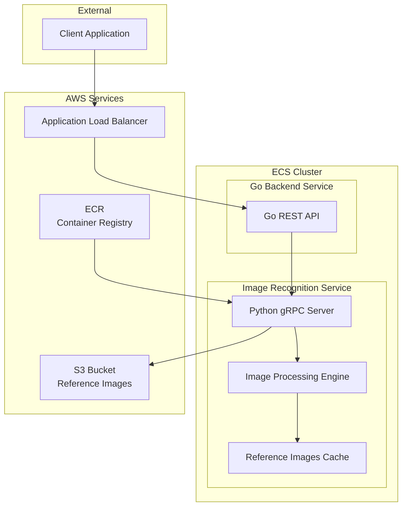

# 設計書

## 概要

画像認識マイクロサービスは、Pythonで実装されるgRPCサーバーとして動作し、入力画像と参照画像の類似度を算出する機能を提供する。サービスはECS Fargateで動作し、既存のGoバックエンドAPIからのみアクセス可能とする。

## アーキテクチャ

### システム構成図



### レイヤー構成

```
services/image_recognition/
├── src/
│   ├── grpc_server/          # gRPCサーバー層
│   │   └── server.py         # gRPCサーバー実装
│   ├── services/             # ビジネスロジック層
│   │   ├── image_service.py  # 画像認識サービス
│   │   └── s3_service.py     # S3操作サービス
│   ├── models/               # データモデル層
│   │   ├── image_model.py    # 画像データモデル
│   │   └── similarity.py    # 類似度計算モデル
│   ├── utils/                # ユーティリティ層
│   │   ├── image_processor.py # 画像前処理
│   │   ├── logger.py         # ログ設定
│   │   └── config.py         # 設定管理
│   └── proto_generated/      # 生成されたProtocol Buffersコード
│       ├── __init__.py
│       ├── image_recognition_pb2.py
│       └── image_recognition_pb2_grpc.py
├── tests/                    # テストコード
├── requirements.txt          # Python依存関係
├── pyproject.toml           # Python設定（mypy設定含む）
├── Dockerfile               # コンテナ定義
└── docker-compose.yml       # ローカル開発用

# Protocol Buffers定義（プロジェクトルート）
schema/proto/
└── image_recognition.proto   # gRPCサービス定義
```

## コンポーネントと インターフェース

### gRPCサービス定義

```protobuf
syntax = "proto3";

package image_recognition;

service ImageRecognitionService {
  rpc RecognizeImage(RecognizeImageRequest) returns (RecognizeImageResponse);
  rpc HealthCheck(HealthCheckRequest) returns (HealthCheckResponse);
}

message RecognizeImageRequest {
  bytes image_data = 1;
  float threshold = 2;  // 0.0-1.0の範囲
}

message RecognizeImageResponse {
  bool is_match = 1;
  float similarity_score = 2;
  string error_message = 3;
}

message HealthCheckRequest {}

message HealthCheckResponse {
  bool healthy = 1;
  string status = 2;
}
```

### 主要コンポーネント

#### 1. gRPCサーバー (grpc_server/server.py)
- **責務**: gRPCリクエストの受信と処理
- **インターフェース**: ImageRecognitionServiceの実装
- **依存関係**: ImageService、ログ設定
- **型チェック**: mypyによる静的型チェック対応

#### 2. 画像認識サービス (services/image_service.py)
- **責務**: 画像類似度の計算とビジネスロジック
- **主要メソッド**:
  - `recognize_image(image_data: bytes, threshold: float) -> RecognitionResult`
  - `load_reference_images() -> None`
  - `calculate_similarity(input_image: np.ndarray, ref_image: np.ndarray) -> float`

#### 3. S3サービス (services/s3_service.py)
- **責務**: S3からの参照画像の読み込み
- **主要メソッド**:
  - `download_reference_images() -> List[ReferenceImage]`
  - `list_reference_image_keys() -> List[str]`

#### 4. 画像処理ユーティリティ (utils/image_processor.py)
- **責務**: 画像の前処理と特徴抽出
- **主要メソッド**:
  - `preprocess_image(image_data: bytes) -> np.ndarray`
  - `extract_features(image: np.ndarray) -> np.ndarray`
  - `normalize_image(image: np.ndarray) -> np.ndarray`

## データモデル

### 画像データモデル

```python
@dataclass
class ReferenceImage:
    """参照画像データモデル"""
    id: str
    category: str  # オブジェ、壁の模様など
    s3_key: str
    features: np.ndarray  # 抽出された特徴量
    metadata: Dict[str, Any]

@dataclass
class RecognitionResult:
    """認識結果データモデル"""
    is_match: bool
    similarity_score: float
    processing_time: float
    error_message: Optional[str] = None
```

### 類似度計算アルゴリズム

#### 特徴抽出手法
1. **SIFT (Scale-Invariant Feature Transform)**
   - キーポイント検出と記述子抽出
   - スケール・回転不変性を持つ
   - オブジェクト認識に適している

2. **ORB (Oriented FAST and Rotated BRIEF)**
   - 高速な特徴点検出
   - バイナリ記述子による効率的なマッチング
   - リアルタイム処理に適している

#### 類似度計算方式
```python
def calculate_similarity(self, input_features: np.ndarray, ref_features: np.ndarray) -> float:
    """
    特徴量ベースの類似度計算
    1. 特徴点マッチング (FLANN matcher使用)
    2. 良好なマッチの割合を計算
    3. 0.0-1.0の範囲で正規化
    """
    matches = self.matcher.knnMatch(input_features, ref_features, k=2)
    good_matches = self._filter_good_matches(matches)
    similarity = len(good_matches) / max(len(input_features), len(ref_features))
    return min(similarity, 1.0)
```

## エラーハンドリング

### エラー分類と対応

| エラータイプ | HTTPステータス | gRPCステータス | 対応方法 |
|-------------|---------------|---------------|----------|
| 画像フォーマットエラー | 400 | INVALID_ARGUMENT | エラーメッセージを返す |
| 閾値範囲外エラー | 400 | INVALID_ARGUMENT | バリデーションエラーを返す |
| S3接続エラー | 503 | UNAVAILABLE | リトライ後、サービス停止 |
| 画像処理エラー | 500 | INTERNAL | ログ出力後、エラーレスポンス |
| メモリ不足エラー | 500 | RESOURCE_EXHAUSTED | ガベージコレクション後リトライ |

### エラーレスポンス例

```python
class ImageRecognitionError(Exception):
    """画像認識サービス専用例外"""
    def __init__(self, message: str, error_code: str):
        self.message = message
        self.error_code = error_code
        super().__init__(message)

# エラーハンドリング実装
try:
    result = self.image_service.recognize_image(image_data, threshold)
    return RecognizeImageResponse(
        is_match=result.is_match,
        similarity_score=result.similarity_score
    )
except ImageRecognitionError as e:
    return RecognizeImageResponse(
        is_match=False,
        similarity_score=0.0,
        error_message=f"{e.error_code}: {e.message}"
    )
```

## テスト戦略

### テストレベル

#### 1. 単体テスト
- **対象**: 各コンポーネントの個別機能
- **ツール**: pytest, unittest.mock
- **カバレッジ目標**: 80%以上

#### 2. 統合テスト
- **対象**: gRPCサーバーとサービス層の連携
- **ツール**: grpcio-testing
- **テストケース**: 正常系・異常系のgRPC通信

#### 3. E2Eテスト
- **対象**: GoバックエンドからPythonサービスへの実際の通信
- **ツール**: Docker Compose環境での結合テスト
- **テストデータ**: 実際の画像ファイルを使用

### テストデータ管理

```python
# テスト用画像データセット
TEST_IMAGES = {
    "identical": "test_data/identical_image.jpg",      # 類似度1.0期待
    "similar": "test_data/similar_image.jpg",          # 類似度0.7-0.9期待  
    "different": "test_data/different_image.jpg",      # 類似度0.3以下期待
    "corrupted": "test_data/corrupted_image.dat",      # エラー期待
}
```

### パフォーマンステスト

```python
@pytest.mark.performance
def test_recognition_performance():
    """認識処理のパフォーマンステスト"""
    start_time = time.time()
    result = image_service.recognize_image(test_image_data, 0.8)
    processing_time = time.time() - start_time
    
    assert processing_time < 5.0  # 5秒以内での処理完了
    assert result.similarity_score >= 0.0
```

## セキュリティ設計

### ネットワークセキュリティ
- **VPC内通信**: プライベートサブネット内でのサービス間通信
- **セキュリティグループ**: GoバックエンドからのgRPC通信のみ許可（インフラレベルで制御）
- **TLS暗号化**: gRPC通信のTLS 1.2以上での暗号化

### 認証・認可
インフラストラクチャレベルでパブリックアクセスを制限するため、アプリケーション側での認証実装は不要。VPCとセキュリティグループによる制御で十分なセキュリティを確保。

### データ保護
- **S3暗号化**: 参照画像のS3保存時の暗号化
- **メモリ保護**: 処理後の画像データの確実な削除
- **ログマスキング**: 機密情報のログ出力防止

## デプロイメント設計

### コンテナ設定

```dockerfile
FROM python:3.11-slim

WORKDIR /app

# システム依存関係のインストール
RUN apt-get update && apt-get install -y \
    libopencv-dev \
    && rm -rf /var/lib/apt/lists/*

# Python依存関係のインストール
COPY requirements.txt pyproject.toml ./
RUN pip install --no-cache-dir -r requirements.txt

# 生成されたprotoファイルのコピー
COPY schema/proto/generated/python/ ./src/proto_generated/

# アプリケーションコードのコピー
COPY src/ ./src/

# gRPCサーバーの起動
EXPOSE 50051
CMD ["python", "-m", "src.grpc_server.server"]
```

### ECS設定

```json
{
  "family": "image-recognition-service",
  "networkMode": "awsvpc",
  "requiresCompatibilities": ["FARGATE"],
  "cpu": "1024",
  "memory": "2048",
  "containerDefinitions": [
    {
      "name": "image-recognition",
      "image": "${ECR_URI}:latest",
      "portMappings": [
        {
          "containerPort": 50051,
          "protocol": "tcp"
        }
      ],
      "environment": [
        {
          "name": "S3_BUCKET_NAME",
          "value": "${S3_BUCKET_NAME}"
        },
        {
          "name": "AWS_REGION",
          "value": "ap-northeast-1"
        }
      ],
      "logConfiguration": {
        "logDriver": "awslogs",
        "options": {
          "awslogs-group": "/ecs/image-recognition-service",
          "awslogs-region": "ap-northeast-1",
          "awslogs-stream-prefix": "ecs"
        }
      }
    }
  ]
}
```

### 監視・ログ設定

```python
import json
import logging
from datetime import datetime
from typing import Any, Dict

class CloudWatchJSONFormatter(logging.Formatter):
    """CloudWatch Logs最適化JSON形式ログフォーマッター"""
    
    def format(self, record: logging.LogRecord) -> str:
        log_entry: Dict[str, Any] = {
            "timestamp": datetime.utcnow().isoformat() + "Z",
            "level": record.levelname,
            "logger": record.name,
            "message": record.getMessage(),
            "module": record.module,
            "function": record.funcName,
            "line": record.lineno,
        }
        
        # 追加のコンテキスト情報があれば含める
        if hasattr(record, 'extra_fields'):
            log_entry.update(record.extra_fields)
            
        # エラー情報があれば含める
        if record.exc_info:
            log_entry["exception"] = self.formatException(record.exc_info)
            
        return json.dumps(log_entry, ensure_ascii=False)

# ログ設定
LOGGING_CONFIG = {
    'version': 1,
    'disable_existing_loggers': False,
    'formatters': {
        'cloudwatch_json': {
            '()': CloudWatchJSONFormatter,
        },
    },
    'handlers': {
        'console': {
            'class': 'logging.StreamHandler',
            'level': 'INFO',
            'formatter': 'cloudwatch_json',
        },
    },
    'loggers': {
        'image_recognition': {
            'level': 'INFO',
            'handlers': ['console'],
            'propagate': False,
        }
    }
}
```
## 型
チェック設定

### mypy設定 (pyproject.toml)

```toml
[tool.mypy]
python_version = "3.11"
warn_return_any = true
warn_unused_configs = true
disallow_untyped_defs = true
disallow_incomplete_defs = true
check_untyped_defs = true
disallow_untyped_decorators = true
no_implicit_optional = true
warn_redundant_casts = true
warn_unused_ignores = true
warn_no_return = true
warn_unreachable = true
strict_equality = true

[[tool.mypy.overrides]]
module = [
    "cv2.*",
    "numpy.*",
    "grpc.*",
    "boto3.*",
    "botocore.*"
]
ignore_missing_imports = true

[tool.mypy-tests.*]
disallow_untyped_defs = false
```

### 型注釈の例

```python
from typing import List, Optional, Tuple, Dict, Any
import numpy as np
import numpy.typing as npt

class ImageService:
    def __init__(self, s3_service: S3Service) -> None:
        self.s3_service = s3_service
        self.reference_images: List[ReferenceImage] = []
    
    def recognize_image(
        self, 
        image_data: bytes, 
        threshold: float
    ) -> RecognitionResult:
        """画像認識処理（型注釈付き）"""
        pass
    
    def calculate_similarity(
        self, 
        input_features: npt.NDArray[np.float32], 
        ref_features: npt.NDArray[np.float32]
    ) -> float:
        """類似度計算（NumPy型注釈付き）"""
        pass
```