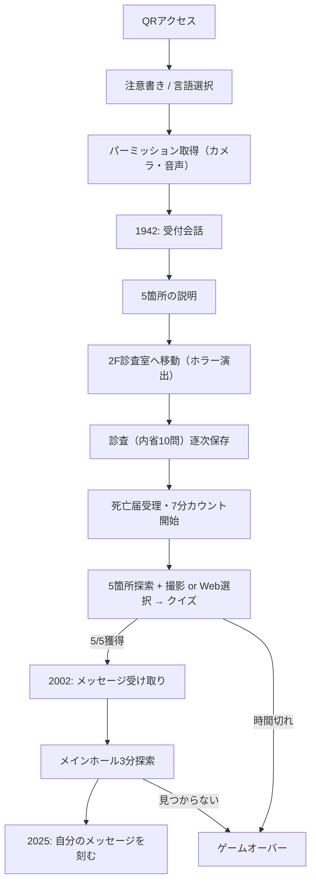
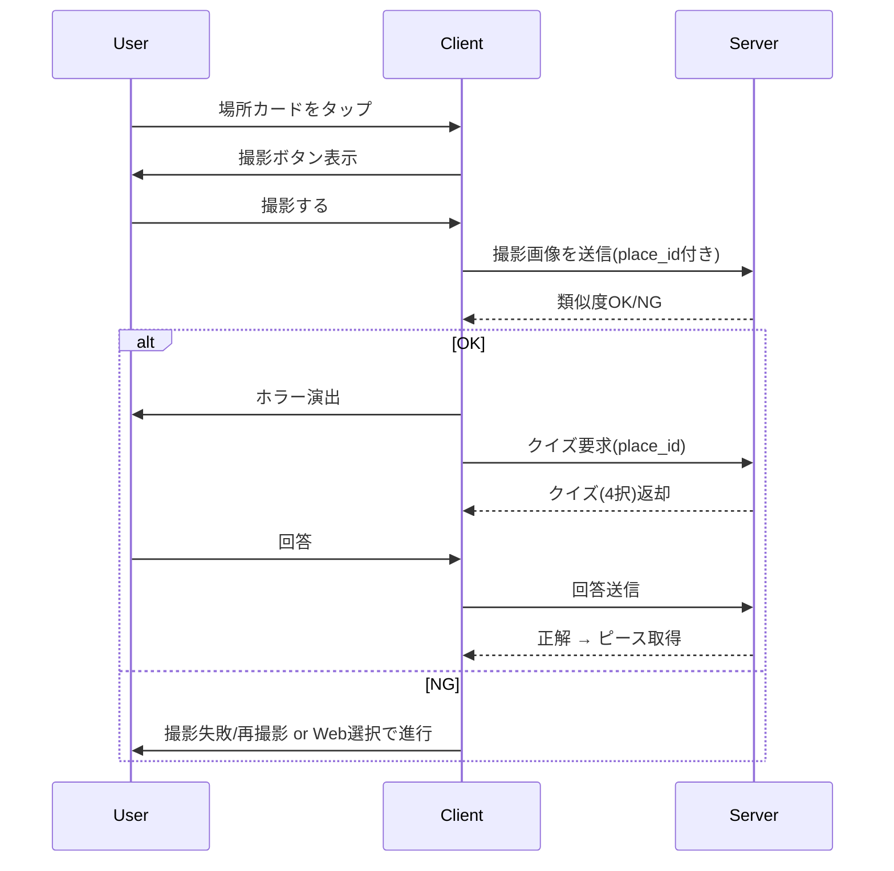

# 仕様書（開発チーム向け）

## 0. 前提・アーキテクチャ
- クライアント：スマートフォンブラウザ（iOS/Android想定）
- サーバ：AWS上のアプリケーション（ECS）  
- 音声生成：AWS EC2上にVOICEVOXサーバを常駐させ、アプリからHTTPで音声生成 → URLをクライアントへ返す
- URL：固定の1本をQRで配布（イベントごとに変えない）
- セッション：初回アクセス時に`session_id (uuid)`を発行し、サーバ側で1時間保持
- 保存：S4の回答は逐次保存。Wi-Fi切断やブラウザリロード後も続きから再開できる

---

## 1. シーン仕様

### 1.1 S0 起動・注意書き・許可
**目的**：カメラ・音声・イヤホンの前提を満たす  
**要素**
- 注意書き（ホラー演出あり・体調注意・イヤホン必須）
- 言語選択（日本語/English）※英語文言は後実装なのでキー化のみ
- カメラ許可ダイアログ表示  
  - 失敗した場合は「カメラなしモード」で進行（AR重畳なし・撮影パートはWeb選択で代替）

**状態遷移**
- 許可OK → S1
- 許可NG → カメラなしフラグを立ててS1へ

---

### 1.2 S1 1942年パート：担当者との初回会話
**音声**
- VOICEVOX（青山龍星(しっとり)）
- テキストは固定文（CMS化しない）

**画面**
- カメラプレビュー＋暗いオーバーレイ
- セリフが1行ずつ表示されるテキストウィンドウ
- ユーザー入力欄（来館方法・普段何してるか・初めてか）

**処理**
- 入力値は「現実のプレイヤーをキャラクター化する」ために保存（後続のクイズ文に直接は使わないが、セッション情報として保持）
- 最後に「お気に入りの場所を覚えておいて」として5地点の説明に遷移

---

### 1.3 S2 お気に入りの場所（固定5点）
**場所の列挙（固定）**
1. 螺旋階段を見上げる高い天井
2. メインホールの暖炉のレンガ
3. 裏玄関の扉の蝶番
4. 入口エントランスの扉（軍需省が持っていった可能性あり）
5. 階上応接室のピアノ（触るな）

**仕様**
- ここで5つすべてを必ず表示する（スキップ不可）
- 後続S6でこの5つが“行くべき場所”として必ず出る
- 実地で立入不可な場合は「ゲーム上では行けません」と表示するためのフラグを場所に持たせる

---

### 1.4 S3 移動指示＋ホラー演出
**目的**：2階診査室への導線＋最初の強い不安演出  
**演出**
- カメラに常時ホラー用フィルターを重ねる（色味+ノイズ）
- ランダムで以下を表示
  - 影
  - 視線
  - 虚な人のシルエット
- SE：低音の環境音＋「こっちに来てはならない」

---

### 1.5 S4 診査室：内省質問パート
**目的**：S6で使うプレイヤー固有の回答を確保する

**質問（固定10問）**
1. 小学生の頃、何に夢中になってた？
2. 中学生の頃、尊敬していた人は誰？
3. 今までの人生の中で、時間を忘れて没頭したことを教えてください。
4. 今一番手放したい自分の能力は?
5. あなたが10億と引き換えにしてでも引き換えたくない能力を教えてください
6. もし今日が人生最後の日だとしたら、どんな人とどんな話をしたいですか？
7. もしお金や時間を気にしなくていいとしたら、今すぐ何をしたいですか？
8. 誰にも反対されないとしたら、どんな場所に住みたいですか。
9. 人生の最期に「いい人生だった」と思うために、何を達成したいですか？（必須・後で一字一句で再回答させる）
10. あー、きみ、なんていう名前だっけ？（必須・“忘れた”で即ゲームオーバー）

**入力制約**
- “なし”“特にない”“わからない”のような無回答はバリデーションで弾く
- 弾かれた場合は「もう少し具体的に教えてください」で再入力
- 10問中でどうしても答えられないものが4問以上ある場合は、補助質問を追加出題して「答えられないが3問以下」になるまで続ける

**保存**
- 各回答は入力完了ごとにサーバへPOST（逐次保存）
- セッション再開時はこの回答をもとにS6のクイズを生成

---

### 1.6 S5 死亡届受理＋7分制限開始（1972年パート）
**表示**
- 「あなたの死亡届が受理されました」
- 「取り消すには、7分以内に先ほどの人の存在証明書と交換する必要があります」
- カウントダウン7:00→0:00を画面常時表示
- 背景は1970年代資料館風の色味をオーバーレイ（実写に重ねる）

**状態**
- `session.s6_started_at` に時刻を記録
- クライアントでもタイマー開始

---

## 2. S6 存在証明書探索パート（詳細）

### 2.1 ゴール
- 5つの場所すべてで「1枚ずつ」ピースを取得 → 合計5枚で完成
- 7分以内に5/5を獲得できなければゲームオーバー
- 最後の1問に回答中に7分を過ぎた場合だけは回答を受け付ける

### 2.2 UI
- 5つの場所をカード表示（順番は固定でOK）
- 各カードには「撮影して証明する」ボタン＋「撮影できないのでこの場所にいることにする」ボタン
- 撮影成功 or 代替選択後にホラー演出→クイズ画面表示
- 画面上に常時「5/5中 2枚取得済み」などの進捗を表示
- タイマー（7:00）は画面上部固定

### 2.3 到達判定
1. 撮影ボタン押下 → カメラ起動 → 撮影画像をサーバへ送信
2. サーバ側で場所ごとに用意した基準画像との類似度を計算  
   - 類似度が閾値（0.5〜0.6想定）以上 → `verified_by = "photo"`
   - 閾値未満 → クライアントに「撮影に失敗しました。周囲をもう少し映してください。」を返す
3. 撮影ができない/失敗し続ける場合は「この場所にいることにする」ボタンで進行し、`verified_by = "manual"`として記録

### 2.4 クイズ生成
- S4で保存した回答群を元に、S6入室時にサーバ側で5問分のクイズを生成しておく（プレイ中に遅延生成しない）
- 各クイズは以下を含む
  - `question_id`
  - `question_text`（「あなたが没頭していたことと、担当者が没頭していたことは？」など）
  - `options[4]`：  
    - 正解：プレイヤー自身の回答  
    - ダミー1：プレイヤーの別回答  
    - ダミー2：過去プレイヤーの匿名回答  
    - ダミー3：システム汎用（足りないときだけ）
  - `answer_index`
- 過去プレイヤー回答はすべて遡って利用する（上限なし）。件数が増えたらサーバ側で動的に制限をかける想定

### 2.5 クイズ回答
- 1問1答
- 正解 → ピース取得 → 場所カードが「取得済み」表示になる
- 不正解 → すぐ再挑戦OK（ペナルティなし）
  - ただし以下のホラー演出を実施：
    - A. 音声「来てはならない」SE
    - B. カメラ上に1秒程度の影をオーバーレイ
- 同じ場所は2回目以降選べないようにロック

### 2.6 タイマーと猶予
- クライアントは7分カウントダウン
- サーバは `s6_started_at` + 7分 を厳密な締切として持つ
- クライアントが「クイズ回答送信」した時刻が締切を超えていた場合でも、その問題が「最後の未取得ピース」なら許可する
- いずれにしても5/5に到達できなければS6終了時にゲームオーバーへ遷移

### 2.7 保存フォーマット（例）
```json
{
  "session_id": "uuid",
  "s6": {
    "started_at": "2025-11-07T13:00:00+09:00",
    "deadline": "2025-11-07T13:07:00+09:00",
    "places": [
      {
        "place_id": "spiral_stairs",
        "verified_by": "photo",
        "quiz_id": "spiral_q1",
        "answered": true,
        "correct": true,
        "answered_at": "2025-11-07T13:02:30+09:00"
      }
    ],
    "pieces_collected": 3,
    "completed": false
  }
}
```

## 3. S7〜S9以降の要点

### 3.1 S7（2002年パート）
- S4で答えた「人生の最期に『いい人生だった』と思うために、何を達成したいですか？」を一字一句で再入力させる
- 不一致の場合は「少し違います。もう一度思い出してください。」で再入力
- ここでS4の回答を出せるように、サーバ保存は必須

### 3.2 S8（メインホール3分探索）
- マップ画像に複数の当たりを持たせる
- 3:00カウントダウン
- 成功：過去プレイヤーのメッセージ一覧を表示
- 失敗：ゲームオーバー
- ジャンプスケアの最大回数：
  - 場所到達時：必ず1回
  - クイズ誤答時：1回
  - → これ以上は出さない

### 3.3 S9（2025年・メッセージ刻み）
- 入力フィールド：最大文字数（例：120文字）
- 「どこに残す？」でS2の5箇所から選択
- 保存は匿名＋セッションIDのみ（IPや端末IDは保持しない）
- 保存したメッセージは後続のプレイヤーに匿名で提示可能

---

## 4. ローカライズ
- 全テキストはキー化する  
  - 例：`text.intro.warning.ja`, `text.intro.warning.en`
- デフォルトは日本語
- 英語リソースはファイルだけ用意し、初期リリースでは未完成でも可

---

## 5. セッションと破棄
- セッションは初回アクセスから1時間で破棄
- 破棄後に同じURLにアクセスした場合は新規セッションとしてS0から
- 途中のS4までの回答は逐次保存のため、1時間以内ならリロードしても続行可

---

## 6. 非機能
- 音量はクライアント側で70%を上限に制御するUIを出す（イヤホン推奨も表示）
- カメラなしモード時はARオーバーレイを表示しない代わりに、ホラー画像を直接DOMに載せる

---

## 7. 図（開発用）

### 7.1 シーン遷移詳細



### 7.2 S6撮影〜クイズフロー
